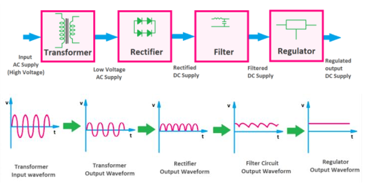
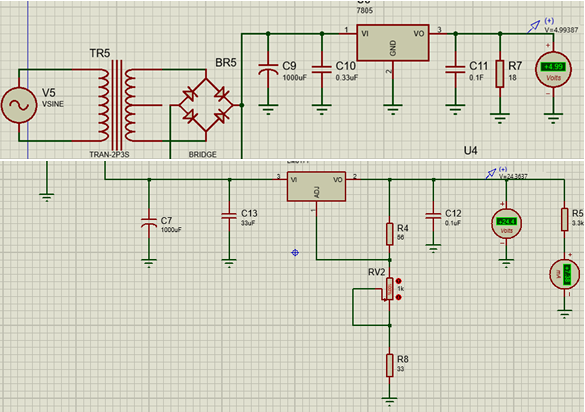
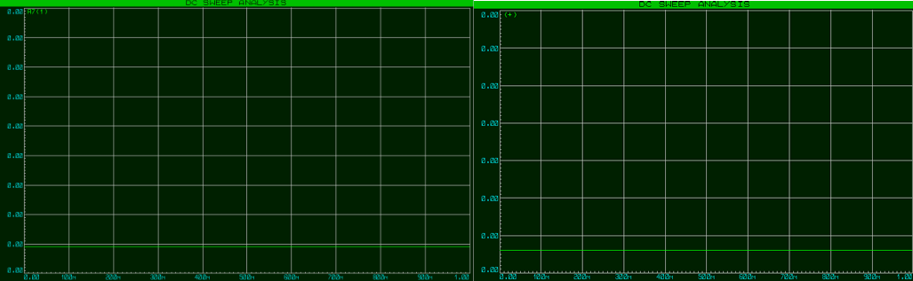
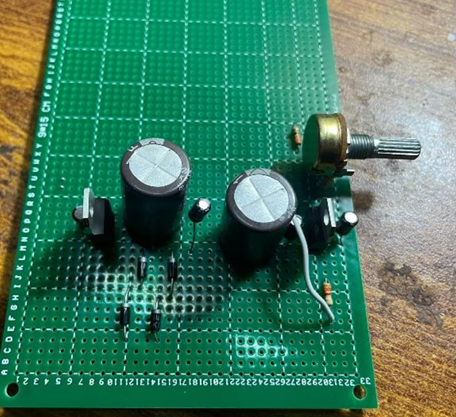

# Dual Output DC Power Supply

A dual-output regulated DC power supply designed and implemented for laboratory and low-power electronics applications. The system converts AC mains into stable DC outputs using rectification, filtering, and voltage regulation techniques.

This project provides:

- One adjustable DC output (**2V–24V**)
- One fixed regulated DC output (**5V**)
- Low-ripple and stable voltage regulation
- AC-to-DC conversion with filtering and regulation stages

---

## Project Overview

This project was developed as part of an Electronic Devices & Circuits (EDC) course to demonstrate practical implementation of analog power electronics concepts including:

- Rectification
- Voltage filtering
- Linear voltage regulation
- Thermal and power handling
- Hardware implementation and testing

The design uses an **LM317 adjustable voltage regulator** for variable output and a **7805 regulator** for a stable 5V output.

---

## Features

✔ Dual independent DC outputs  
✔ Adjustable output from **2V to 24V DC**  
✔ Fixed **5V regulated output**  
✔ Stable low-ripple voltage output  
✔ AC-to-DC conversion using rectifier circuitry  
✔ Hardware-tested and simulated in Proteus  
✔ Practical implementation of analog electronics concepts

---

## System Architecture

The power supply follows a multi-stage architecture:

```text
AC Input
   ↓
Step-Down Transformer
   ↓
Bridge Rectifier
   ↓
Filter Capacitor
   ↓
Voltage Regulation Stage
   ├── LM317 (Variable Output: 2V–24V)
   └── 7805 (Fixed Output: 5V)
   ↓
Output Terminals
```

---

## Components Used

### Hardware Components

- Center-tapped transformer (12-0-12V)
- Silicon diodes (Bridge Rectifier)
- Capacitors
- Resistors
- 56Ω resistor
- Potentiometer (5kΩ)
- BJT transistor
- LM317 voltage regulator
- 7805 voltage regulator

### Software Tool

- Proteus (Simulation & Validation)

---

## Working Principle

The system converts AC voltage into stable DC outputs through multiple processing stages:

### 1. Step-Down Transformation

The transformer reduces high AC input voltage to a safer and usable level suitable for electronic circuits.

### 2. Rectification

A bridge rectifier converts alternating current (AC) into pulsating DC.

### 3. Filtering

Capacitors smooth voltage ripples and provide a more stable DC waveform.

### 4. Voltage Regulation

The filtered DC is passed through:

- **LM317** for adjustable output voltage
- **7805** for constant regulated **5V output**

This enables simultaneous fixed and variable voltage supply operation.

---

## Circuit Topology & Block Diagram



The design consists of:

1. Step-down transformer  
2. Full-wave bridge rectifier  
3. Filtering capacitor  
4. Voltage regulation stage  
5. Output terminal stage

---

## Design Calculations

### Ripple Voltage Calculation

Capacitor sizing was performed to minimize ripple voltage and improve output stability.

Formula used:

C = I / (2fVr)

Where:

- **I** = Load current
- **f** = Rectified frequency
- **Vr** = Allowable ripple voltage

Design assumptions:

- Load Current = **1A**
- Frequency = **50 Hz**
- Capacitor = **1000 µF**

### LM317 Output Voltage Design

The adjustable output voltage is determined using:

```text
Vout = 1.25(1 + R2/R1)
```

Design target:

- Minimum output ≈ **2V**
- Maximum output ≈ **24V**

A potentiometer was used to vary output voltage smoothly within the required operating range.

---

## Simulation & Results

The circuit was simulated in **Proteus** to validate performance before hardware implementation.

### Schematic Diagram





### Simulation Observations

- Smooth filtered DC output observed
- Adjustable output varied from **2V–24V**
- Stable fixed **5V output**
- Reduced ripple after filtering stage

---

## Hardware Implementation

The circuit was assembled and tested physically.



Implementation process:

- Rectifier stage tested independently
- Filter capacitor stage verified
- Regulator outputs measured using multimeter
- Grounding issues optimized for stable output

---

## Testing & Results

Experimental testing confirmed:

### Channel 1 — Variable Output

- Smooth adjustment from **2V to 24V**

### Channel 2 — Fixed Output

- Constant regulated **5V output**

The system produced stable DC outputs under operating conditions.

---

## Results Summary

| Feature | Result |
|----------|--------|
| Variable Output | 2V–24V |
| Fixed Output | 5V |
| Load Current | 1A |
| Simulation | Successful |
| Hardware Testing | Successful |

---

## Engineering Concepts Demonstrated

- Analog Circuit Design
- AC to DC Conversion
- Rectifier Design
- Voltage Regulation
- Ripple Reduction
- Electronic Testing & Debugging
- Proteus Simulation
- Hardware Prototyping

---

## Future Improvements

Potential enhancements include:

- Overcurrent protection
- LCD voltage monitoring
- Current limiting circuit
- PCB implementation
- Heat sink optimization
- Digital voltage control

---

## Project Outcome

The project successfully achieved the required design objectives by delivering a stable and reliable dual-output DC power supply capable of supplying both fixed and adjustable regulated voltages for electronics applications.

---

**Muhammad Bilal Chaudhry**  
Electrical Engineering — NUST
